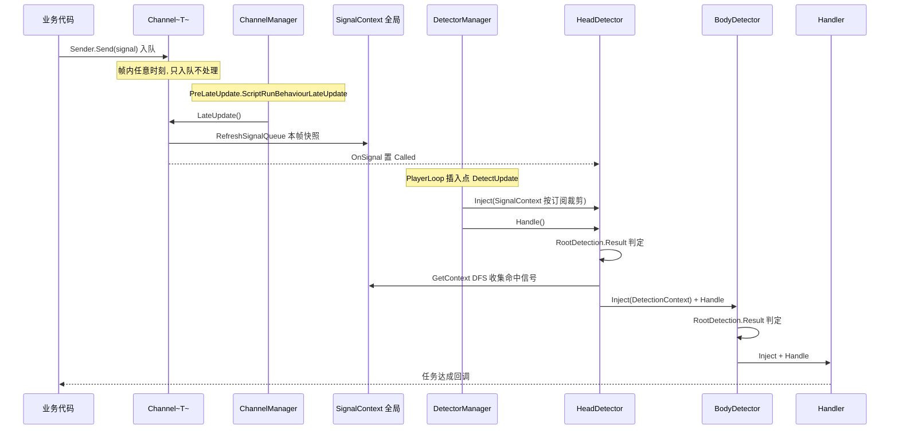

# TaskFlow · 信号驱动的轻量任务系统

> 关键词：Signal 触发 → Detection 判定 → Handler 处理 · ScriptableObject 通道 · 观察者解耦 · PlayerLoop 调度 · 组合模式判定

## 1. 系统定位

TaskFlow 是一个 Unity 游戏内任务系统，以 **「信号触发 → 判定 → 处理」** 为核心链条工作。

**适用**：短任务、子任务、成就系统等聚焦于"某个事件的发生与判断及处理"的场景。

**不适用**：大型主线任务系统（任务状态机、任务链/前置依赖、存档回滚等不在本系统职责内）。

**当前状态**：PlayMode Runtime 核心链已完成；Editor 配置与依赖注入（订阅编辑、判定树编辑、序列化注入）**开发中**。

## 2. 核心概念

| 概念 | 载体 | 职责 |
|---|---|---|
| **Signal** | 普通 C# 类（POCO） | 一次业务事件的数据包（如 `EnemyDeadSignal { int EnemyId }`），带时间戳 |
| **Channel\<T\>** | ScriptableObject | 同类信号的**通道**：缓存信号队列，每帧把队列快照注入全局 SignalContext，并广播唤醒事件 |
| **Sender** | 静态类 | 业务侧唯一入口：`Sender.Send(new XxxSignal())`，按信号类型路由到对应 Channel |
| **Detector** | ScriptableObject | 判定节点，持有判定树 `RootDetection`。分两层：**HeadDetector**（被 PlayerLoop 驱动，消费 SignalContext）与 **BodyDetector**（被上游级联驱动，消费 DetectionContext） |
| **Detection** | 可序列化类 | 判定树节点。**AtomicDetection**（Equal / Compare / Contain）与 **CombinationDetection**（And / Or / Not）组合成任意复杂判定 |
| **SignalContext** | 运行时对象 | 全局「通道 → 本帧信号队列」快照，HeadDetector 按订阅裁剪读取 |
| **DetectionContext** | 运行时对象 | 「判定路径 → 信号」的结果上下文，沿 Head → Body → Handler 逐级传递 |
| **IReceiver / IHandler** | 接口 | 下游节点契约：`Inject(上下文)` + `Handle()` |
| **ChannelManager / DetectorManager** | MonoSingleton | 分别驱动 Channel 刷新与 HeadDetector 批量判定 |

## 3. 架构总览

```mermaid
classDiagram
  class Signal {
    <<abstract>>
    +float TimeStamp
  }
  class Sender {
    <<static>>
    +Send~T~(T signal)$
  }
  class BaseChannel {
    <<abstract>>
    +UnityAction OnSignal
    +LateUpdate()*
  }
  class Channel~T~ {
    -ConcurrentQueue~T~ _eventQueue
    +AddMessage(T signal)
  }
  class IPorter {
    <<interface>>
    +UnityAction OnSignal
  }
  class IReceiver {
    <<interface>>
    +Inject(DetectionContext)
    +Handle()
  }
  class Detector {
    <<abstract>>
    +Detection RootDetection
    +bool Called
    +bool SelfActive
  }
  class HeadDetector {
    +Inject(SignalContext)
  }
  class BodyDetector
  class Detection {
    <<abstract>>
    +Result(context)*
    +GetContext()*
  }
  class AtomicDetection
  class CombinationDetection
  class Equal
  class Compare
  class Contains
  class And
  class Or
  class Not
  class SignalContext
  class DetectionContext
  class ChannelManager
  class DetectorManager

  BaseChannel <|-- Channel~T~
  BaseChannel ..|> IPorter
  Detector ..|> IPorter
  Detector ..|> IReceiver 
  Detector <|-- HeadDetector
  Detector <|-- BodyDetector
  Detection <|-- AtomicDetection
  Detection <|-- CombinationDetection
  AtomicDetection <|-- Equal
  AtomicDetection <|-- Compare
  AtomicDetection <|-- Contains
  CombinationDetection <|-- And
  CombinationDetection <|-- Or
  CombinationDetection <|-- Not
  Detector o-- Detection : RootDetection 判定树
  Detector o-- IPorter : _porters 订阅
  Detector o-- IReceiver : _receivers 派发
  ChannelManager o-- BaseChannel : 驱动
  DetectorManager o-- HeadDetector : 驱动
  HeadDetector ..> SignalContext : 读本帧信号
  BodyDetector ..> DetectionContext : 读上游结果
  note for Detector "porters / receivers 均为 Detector 自身类型<br/>订阅其他 IPorter、派发给其他 IReceiver<br/>构成 Head → Body → Handler 级联"
````
## 4. 一帧之内的数据流

```mermaid
flowchart LR
  A["业务代码<br/>Sender.Send(signal)"] --> B["Channel~T~ 信号队列<br/>(仅入队, 不处理)"]
  B --> C["ChannelManager.LateUpdate<br/>队列快照 → SignalContext"]
  C --> D["Channel.OnSignal 广播<br/>置位 HeadDetector.Called"]
  D --> E["DetectorManager.DetectAll<br/>(PlayerLoop: LateUpdate 之后)"]
  E --> F["HeadDetector<br/>RootDetection 判定 SignalContext"]
  F -->|成功| G["GetContext() DFS 重组<br/>构建 DetectionContext"]
  G --> H["BodyDetector 级联判定<br/>(Inject + Handle 同步递归)"]
  H --> I["IHandler / 业务处理<br/>任务达成 / 成就弹出"]

```

一帧内的精确时序：



> **为什么插在 `PreLateUpdate.ScriptRunBehaviourLateUpdate` 之后？** 保证所有 MonoBehaviour 的 `LateUpdate`（含 ChannelManager 的队列快照）先执行完，判定读到的信号一定是"本帧完整快照"，不会出现半帧数据。

## 5. 快速上手

### 第 1 步：定义信号（程序）

```csharp
using TaskFlow;

public class EnemyDeadSignal : Signal
{
    public int EnemyId;
}
```

### 第 2 步：生成通道（Editor 自动）

菜单 `TaskFlow > Generate Signal Channels`（编译重载后自动执行），为每个 Signal 子类生成封闭泛型通道：

```csharp
// Assets/TaskFlow/Generated/EnemyDeadSignalChannel.cs（自动生成）
public sealed class EnemyDeadSignalChannel : Channel<EnemyDeadSignal> { }
```

### 第 3 步：创建通道资产（Editor）

`Create > TaskFlow/Channel/Enemy Dead Signal Channel`。
**约定：资产必须位于任意 `Resources/TaskFlow/Channel/` 目录下**（`ChannelManager` 启动时按此路径加载）。

### 第 4 步：发送信号（程序，任意位置任意时机）

```csharp
    Sender.Send(new EnemyDeadSignal { EnemyId = 1001 });
```

### 第 5 步：配置判定（Editor，部分依赖待完成的注入工具）

1. 创建 `Create > TaskFlow/Head Detector`，在订阅列表中加入第 3 步的 Channel；
2. 配置 `RootDetection` 判定树（如 `And( Contains(信号字段, 集合), Compare(数值) )`）；
3. 需要级联时创建 `Body Detector`，挂到 HeadDetector 的 receivers；
4. 终端业务实现 `IHandler`（MonoBehaviour 或自定义节点），在 `Handle()` 中收到 `DetectionContext` 完成处理。

> ⚠️ 订阅列表编辑、判定树可视化编辑、序列化注入属 Editor 待开发部分，见 §8。

## 6. 重点实现

### 6.1 PlayerLoop 注入

`DetectorManager` 通过 `PlayerLoop` 低层 API 把 `DetectAll` 插入 `PreLateUpdate.ScriptRunBehaviourLateUpdate` 之后，独立于任何 MonoBehaviour 生命周期：

```csharp
[RuntimeInitializeOnLoadMethod]
private static void InitDetectorLoop()
{
    var detectUpdate = new PlayerLoopSystem {
        type = typeof(DetectUpdate),
        updateDelegate = DetectAll
    };
    var current = PlayerLoop.GetCurrentPlayerLoop();
    current = current.InsertSystemAfter<PreLateUpdate.ScriptRunBehaviourLateUpdate>(detectUpdate);
    PlayerLoop.SetPlayerLoop(current);
}
```

收益：判定的触发**不依赖场景中存在任何组件**，且与 Unity 帧循环严格同步；`InsertSystemAfter` 采用"复制数组再替换"的递归实现，避免 struct `PlayerLoopSystem` 的值拷贝副作用。

### 6.2 泛型 Channel 的编译期代码生成

`Channel<T>` 是泛型类，无法作为资产挂载。`SignalChannelGenerator` 在**编译重载后自动**扫描全部 Signal 子类，生成封闭泛型子类文件：

- 用 `TypeCache.GetTypesDerivedFrom<Signal>()` 收集，无反射全扫开销；
- 生成内容做**全文比对**，无变化不触发重编译，避免「重载→生成→再重载」死循环；
- 自动**清理孤儿文件**（Signal 被删除后，对应生成文件带 MarkerTag 被识别删除）；
- 嵌套类型 `Outer+Inner` 转换为合法的 `Outer_Inner` 类名与 `Outer.Inner` 类型引用。

### 6.3 MemberGetter：表达式树反射缓存

判定树通过字符串字段路径（`FieldPath.FieldName`）取信号字段，`MemberGetter` 做了两级缓存把反射开销降到常量级：

1. **元数据负缓存**：`(Type, name) → FieldInfo`，查不到也缓存 null，错误日志只报一次；
2. **委托缓存**：`(FieldInfo, T) → 编译后的 Expression.Lambda`，字段类型与 T 完全一致时零装箱；`Nullable<T>` 先解包再做兼容性检查；
3. 全部容器为 `ConcurrentDictionary`，编译在锁外进行、原子写回，多线程竞争下幂等。

### 6.4 双上下文与路径寻址

系统刻意区分两个上下文，对应 Head 与 Body 两层不同的判定输入：

| | SignalContext | DetectionContext |
|---|---|---|
| 内容 | `通道 Porter → 信号队列` | `判定路径 → 命中信号` |
| 生产者 | ChannelManager 每帧快照 | HeadDetector 判定成功后 DFS 重组 |
| 消费者 | HeadDetector（按订阅裁剪） | BodyDetector / Handler |

`FieldPath` 支持两种寻址：`SignalContextPath`（直取某通道某类型信号的字段）与 `DetectionContextPath`（取上游判定命中的信号字段）。判定成功后 `GetContext()` 以 **DFS 遍历判定树**逐层收集命中信号，并沿途把本层 Detection Push 进路径——下游 BodyDetector 因此既能拿到"信号值"，也能知道"它在判定树中的位置"。

### 6.5 Head / Body 两级判定

- **HeadDetector**：唯一的 PlayerLoop 驱动入口。只有被 Channel 的 `OnSignal` 置位 `Called` 的实例才会在本帧 `Inject + Handle`，避免空转；
- **BodyDetector**：由上游 `Handle` 内**同步递归**派发（`Inject` 上下文后立刻 `Handle`），天然保证上下文时序；订阅（porters）与派发（receivers）分离，形成有向无环的任务网。

## 7. 目录结构

Assets/  
├── TaskFlow/  
│ ├── Editor/ # 信号通道代码生成器  
│ ├── Generated/ # 自动生成的封闭泛型 Channel（勿手改）  
│ ├── Runtime/  
│ │ ├── abstract/ # Signal / BaseChannel / Detector / Sender  
│ │ ├── interfaces/ # IPorter / IReceiver / IHandler  
│ │ ├── Context/ # SignalContext / DetectionContext（双上下文）  
│ │ ├── Detection/ # Detection / AtomicDetection / CombinationDetection  
│ │ ├── extends/ # Channel<T> / HeadDetector / BodyDetector  
│ │ ├── Manager/ # ChannelManager / DetectorManager / MonoSingleton / PlayerLoop 扩展  
│ │ ├── Ultility/ # MemberGetter / 命名拆分  
│ │ └── Atrributes/ # InspectorReadOnly  
│ └── Sample/ # 最小示例（完善中）  
├── Tests/  
│ ├── MultiChannelModel/ # 独立平行测试模型（多通道/多Detector 订阅验证）   
│ └── MultiChannelModelTests.cs  
├── design/Task-Plan.md # 迭代设计日志  
└── README/ # 本文档 + 设计心路《Unity 任务系统.md》  


## 8. 已知限制与路线图

### 当前约定（重要）

- Channel 资产必须放在 `Resources/TaskFlow/Channel/` 下，否则运行时找不到；
- HeadDetector 资产需被 Resources 加载或场景引用后才会被 `DetectorManager` 发现；
- 订阅关系目前需代码 `AddSubscriber` 建立，Inspector 编辑待 Editor 工具完成。

### Editor 阶段路线图

- [ ] 订阅关系可序列化（`List<SO>` 配置 + 运行时解析），Inspector 下拉编辑；
- [ ] 判定树 `[SerializeReference]` + 树形 PropertyDrawer / UIToolkit 编辑器；
- [ ] `FieldPath` 重构为可序列化形态（SO 引用 + detectionId 链 + 字段名）；
- [ ] 清单资产（Manifest）统一管理 Channel / Detector，替代散装 Resources 约定；
- [ ] Asset 校验器：字段路径类型匹配、悬空引用、级联环检测；
- [ ] 运行时 Context 调试窗口（实时查看每帧快照与判定命中）；
- [ ] HeadDetector 排序（同帧确定性）、级联异常隔离；
- [ ] 补充判定类型：计数、序列、时间窗口（见《Unity 任务系统.md》§判别类型草稿）；
- [ ] Runtime 本体的端到端 PlayMode 测试（Send → 下一帧命中 → Handler 收到上下文）。

### 设计边界

- 判定发生在帧边界（LateUpdate 之后），**同帧内多次发送**会被合并为一次快照判定；
- 任务数据不做持久化，进度/存档由上层 Handler 自行负责；
- 面向事件型短任务，不提供任务状态机与依赖图。