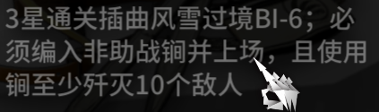

# Unity 任务系统

> 关键词：任务系统；事件与委托；Srciptable Object；解耦；中介者模式；
> 
> 

任务系统其实就是一个实时的记录器，记录的事情无非两种：

1. **行为**：游戏中的你在什么时间做了什么事情，达成了什么效果；

2. **数值**：通用数值（如背包中物品数量，当前银行账户数额）达成了什么样的标准；

# 一次迭代\-设计功能基础

这次我们先从行为说起。

举个栗子：你需要清理的日常任务中，一共有两项：

1. 击败敌人5名；

2. 释放大招1次；

行为记录的议题说简单非常简单，你只需要在人物行为发生时，使用一个全局变量记录即可：

```C#
public class ActionRecorder
{
    private static ActionRecorder _instance;
    public static ActionRecorder Instance =>
        {
            if(_instance == null)
                _instance = new ActionRecorder();
            return _instance;
        }
        
    //key:action name, value:invoke count
    Dictionary<string, int> actionCountRecorder = new ();
}

public class Enemy : MonoBehaviour
{
    public void OnDead()
    {
        //...
        // 在敌人死亡时，在字典中找到名为"Enemy Dead"的数据进行记录
        ActionRecorder.Instance.actionCountRecorder["Enemy Dead"]++;
        //...
    }
}

public class PlayerController : MonoBehaviour
{
    public void OnUseUtimate()
    {
        //...
        // 在角色放大招时，在字典中找到名为"Use Utimate"的数据进行记录
        ActionRecorder.Instance.actionCountRecorder["Use Utimate"]++;
        //...
    }
}
```

在这里，我们使用了`ActionRecorder.actionCountRecorder`在不同对象行为发生时进行记录。

这样写能够应付 GameJam，非常简单，简单到你甚至无需专门看上面这一段。

当然也有稍微完整一点的方式，这种可以直接拿去用了：

```C#
public class ActionRecorder
{
    private static ActionRecorder _instance;
    public static ActionRecorder Instance =>
    {
        if(_instance == null)
            _instance = new ActionRecorder();
        return _instance;
    }

    *// 当前进度计数，key:action name, value:invoke count*
*    *Dictionary<string, int> actionCountRecorder = new ();
    *// 预期任务数量，key:action name, value:expected quantity*
*    *Dictionary<string, int> actionExpQuan = new ();

    public void HandleProgress(string taskName)
    {
        *// 进度已满，返回*
*        *if(actionCountRecorder[taskName] == actionExpQuan[taskName])
            return;
        *// 在触发进度时，在字典中找到对应任务的数据进行记录*
*        *actionCountRecorder[taskName]++;
        Debug.Log($"Task{taskName} Progress: {actionCountRecorder[taskName]}/{actionExpQuan[taskName]}.");

        *// 处理任务满进度*
*        *if(actionCountRecorder[taskName] == actionExpQuan[taskName])
        {
            *//...*
*            *Debug.Log($"Task{taskName} Complete.");
        }
    }
}

public class **Enemy **: MonoBehaviour
{
    public void OnDead()
    {
        *//...*
*        // 在敌人死亡时，在字典中找到名为"Enemy Dead"的数据进行记录*
*        *ActionRecorder.Instance.HandleProgress("Enemy Dead");
        *//...*
*    *}
}

public class **PlayerController **: MonoBehaviour
{
    public void OnUseUtimate()
    {
        *//...*
*        // 在角色放大招时，在字典中找到名为"Use Utimate"的数据进行记录*
*        *ActionRecorder.Instance.HandleProgress("Use Utimate");
        *//...*
*    *}
}
```

但是这样写会有什么问题呢？随着项目开发的进行，内部的测试与调整、版本内容的迭代，总之**任务触发**会发生时机或内容上的变化。当策划提出“使用大招并击败敌人”时，程序可能还健在；当策划提出“使用大招并同时击败5名敌人”时，程序有点红温；当策划提出：我要把那个任务给撤了，换成“在霸体状态下击败5名敌人”，再加3个并列任务……

——此时项目已经进行到了中后期，各种任务设置满天飞。这段名为`PlayerController.cs`的文件，程序已经八百年没有打开过了，上一次对这个内部逼近 400 行屎山极限的文件有印象的时候，还是被 Agent 这个傻\*加了代码，看文件 diff 的时候突然意识到这个文件是一个上古时期就封装测试好的……

说回程序去改任务内容这件事，诶我程序哪去了？策划…策划也不见了？！

“不是？你自己做的游戏，这么多\*事你怎么不自己改，（围殴），自己改，（围殴），自己改，（围殴）……”

“我不会……呃——”


所以为了避免程序同策划吵（殴）架（打），应该设计一个**可管理、可视编辑、可热更、可联合条件判定**的框架。

---

# 二次迭代\-设计传递通道

当前的原型设计方式是利用`ActionRecorder`进行集中式管理，一个字典管天下，所有数据都在 Recorder 里，同时所有的任务响应都要经过`ActionRecorder.Instance`，设计中响应处理对实例的需求较高。

下面的工作就是解决上述问题。

1. 解除任务实体与任务处理器耦合，加入一个通道，介入实体与处理器之间；

2. 在 1\. 的基础上还可以更进一步：解除任务集中式管理，让每个任务响应都有自己的路径，将任务的响应流程变为分布式；

这种设计模式被称作**中介者模式**，其具体思想是，使用一个中介者（Mediator，媒介）去牵手其它比较重型的系统，专门负责传递系统间的通信和响应，以此将系统有效解耦。

对以上两种设计的结构的实现分别有以下两种路径：

1. 使用C\#静态事件总线，对应了设计 1；创建一个静态类维护全局唯一的委托，任何脚本都可以通过静态类发送消息；

2. 使用`Scriptable Object`作为事件通道，对应了设计 2；每个任务都制作一个专有的 SO 文件，作为实体与处理器通讯的通道。

## 静态事件总线设计

1. 通过静态类`TaskEventBus`维护一个全局唯一的委托。任何脚本都可以通过`TaskEventBus.Publish`发送消息。

    ```C#
    [Serializable]
    public static class TaskEventBus
    {
        *// 定义一个静态委托*
    *    *public static Action<string, int> OnActionExecuted;
    
        public static void Publish(string id, int amount)
            => OnActionExecuted?.Invoke(id, amount);
    }
    ```

2. 设计`BusQuestMonitor`处理任务响应。`BusQuestMonitor`在唤醒时订阅`TaskEventBus.OnActionExecuted`以接受响应。

    ```C#
    public class **BusQuestMonitor **: MonoBehaviour
    {
        public string **targetID**;
        public int **required**;
        private int current;
    
        // 激活时订阅： 有信号发送时启用处理
        private void **OnEnable**() => TaskEventBus.OnActionExecuted += HandleProgress;
        private void **OnDisable**() => TaskEventBus.OnActionExecuted -= HandleProgress;
    
        void HandleProgress(string id, int amount)
        {
            if (id != targetID) return;
            if (current >= required) return;
            
            current += amount;
            Debug.Log($"[静态事件] {targetID} 进度: {current}/{required}");
            if (current >= required) Debug.Log($"{targetID} 任务达成！");
        }
    }
    ```

3. 在任务实体中，通过`TaskEventBus.Publish`使用静态事件总线发送任务响应。

    ```C#
    public class **PlayerController **: MonoBehaviour
    {
        *// 模拟：释放大招*
    *    *public void **OnUseUltimate**()
        {
            *// 从静态事件发送响应*
    *        *TaskEventBus.Publish("Ult", 1);
        }
    }
    
    public class Enemy : MonoBehaviour
    {
        // *模拟：敌人死亡*
        public void OnDead()
        {
            *// 从静态事件发送响应*
            TaskEventBus.Publish("Enemy", 1);
        }
    }
    ```

这里的总线是`TaskEventBus`承担，其在内存中实际数据是`Action<``string``, ``int``> OnActionExecuted`，**Action** 类型作为无返回委托类型，可以装载多个函数指针，在`OnActionExecuted?.Invoke(id, amount)`中按次序调用所有订阅的`BusQuestMonitor.HandleProgress`。而在具体的`HandleProgress`中，会比较此次响应的编码，选择是否做出响应。

### 实际应用


## ScriptableObject 事件通道设计

1. 设计`TaskEventChannelSO`作为一个中介者（Mediator），其本身是一个 `.asset` 文件。发布者（`PlayerController`）和订阅者（`SOQuestMonitor`）都引用同一个 SO 实例，通过文件通信。

    ```C#
    [CreateAssetMenu(menuName = "TaskSystem/EventChannel")]
    public class **TaskEventChannelSO **: ScriptableObject
    {
        *// 传递 ID (如 "Enemy") 和 数量*
    *    *public UnityAction<string, int> OnRaised;
        public void Raise(string id, int amount) => OnRaised?.Invoke(id, amount);
    }
    ```

2. 设计`SOQuestMonitor`处理任务响应，`SOQuestMonitor`会被设置单独服务的通信通道，在唤醒时订阅`TaskEventChannelSO.OnRaised`以接受响应。

    ```C#
    public class **SOQuestMonitor **: MonoBehaviour
    {
        public TaskEventChannelSO **channel**; *// 拖入对应的 SO*
    *    *public string **targetID**;            *// 比如 "Enemy" 或 "Ult"*
    *    *public int **required**;
        private int current;
    
        private void **OnEnable**() => channel.OnRaised += HandleProgress;
        private void **OnDisable**() => channel.OnRaised -= HandleProgress;
    
        void HandleProgress(string id, int amount)
        {
            if (id != targetID) return;
            if (current >= required) return;
            
            current += amount;
            Debug.Log($"[SO系统] {targetID} 进度: {current}/{required}");
            if (current >= required) Debug.Log($"{targetID} 任务达成！");
        }
    }
    ```

3. 在任务实体中，通过`channel.Raise`使用 SO 通道发送任务响应。

    ```C#
    public class **PlayerController **: MonoBehaviour
    {
        [Header("SO引用的通道")]
        public TaskEventChannelSO **soUltChannel**;
        *// 模拟：释放大招*
    *    *public void **OnUseUltimate**()
        {
            soUltChannel.Raise("Ult", 1);
        }
    }
    
    public class Enemy : MonoBehaviour
    {
        [Header("SO引用的通道")]
        public TaskEventChannelSO **soDeadChannel**;
        // *模拟：敌人死亡*
        public void OnDead()
        {
            soDeadChannel.Raise("Enemy", 1);
        }
    }
    ```

这里的通信通道是`TaskEventChannelSO`承担，其在内存中实际数据是`UnityAction<string, int> OnRaised`，这个通道只服务一个或一种任务。同种任务可以由多处触发，但都会由一个通道传递响应。

在任务实体中发送的响应，会通过 SO 文件连通处理器，找到对应的`HandleProgress`接受任务响应。

### 实际应用


---

# 三次迭代\-设计组合模式判定

现在我们还没有解决一个问题：

> *当策划提出**“使用大招并击败敌人”**时，程序可能还健在；当策划提出**“使用大招并同时击败5名敌人”**时，程序有点红温；当策划提出：我要把那个任务给撤了，换成“**在霸体状态下击败5名敌人**”，再加3个并列任务……*
> 
> 

如果问题还不解决，程序依然会讨（殴）伐（打）策划。

问题的要点在于，策划的需求是多变与多样的，而我们在代码中需要封装。

问题的解决方式即：将任务信号细分到原子级，“埋”在任务实体中，不再去做修改；转而将多样的任务判定放在任务实体的外部，再像原子组合成分子一样，将不同的信号组合为一个新的任务判定。

这就像是程序在Unity里面造轮子，然后一层层地组合、联结与嵌套，最终造出了一个比较复杂的功能实体，同时这个功能实体下面的70%的功能可以再通过这样的方式使用在其它种类的实体上，造出另外一个不同的功能。

这种设计遵循**组件化原则，通过任务逻辑的解耦，实现了高度的模块复用性**。系统的底层判定逻辑可作为通用的**中间件或功能预制体**，快速装配到不同的 Handler 中。


---

# 项目设计

## 草稿\-判别类型

1. **原子判别: \<**信号源端口，信号参数引用，自设定**\>**

    1. **Equal：Object**

    2. **NotEqual：Object**

    3. **Greater：number**

    4. **Less：number**

    5. **GreaterOrEqual：number**

    6. **LessOrEqual：number**

    7. **Contains：\<object, collection\>**

    8. **NotContains：\<object, collection\>**

2. 完成判别：接收到信号就算完成\<signal\>


3. 计数判别：总共计数；\<signal param,number\>


4. 序列判别：按照一定次序完成；\<signal param\[\]\>

5. 时间窗口：在某个时间窗口内完成一系列；\<time，\(signal param, count\)\[\]\>

6. 时间窗口序列判别：\<time，\(signal param, count\)\[\]\>

7. 组合逻辑判别：**Collection\<Detection\>**

    1. AND，

    2. OR，

    3. NOT；


