## Problem
### Channel 泛型声明不能被Component成功挂载
#### 方案：
1.  ~~尝试能否代码挂载~~ *太麻烦了，对Editor内序列化操作不够友好*
2. ~~尝试对Signal使用Atrribute，编译时自动对Signal基类对应的泛型基类进行自动生成~~ *没有物理文件，无法在editor里面挂载*
3. 编译时让Editor扫描，自动对使用Signal子类对应的泛型基类进行封闭子类声明。
4. Channel只当SO，注入动作由Manager发起

#### 执行：
1. [x] Channel改SO，把LateUpdate的调用改Manager里面去；
2. [x] 编译时让Editor扫描，自动对使用Signal子类对应的泛型基类进行封闭子类声明。

### Detector 上下文注入过程对“订阅”体现过差
#### 当前过程：

1. Channel是把信号放在一个公共上下文中的，没有直接发给Detector；
2. 让Detecto做事，只给了一个唤醒信号，其它什么也没有给;
3. 未处理好`Detector`中`handle`判定处理与唤起下一级连接的关系；
#### 修复：
1. [x] 公共上下文移到`Manager`中，~~不再设为`static`~~；
2. [ ] 在`Channel`中不使用`subscribers`数据，改为观察者模式：
   - [x] `Channel`对公共上下文的注入改为请求式，
   - [X] `Detector`在订阅时自己维护`Channel`，
   - [x] 并在订阅时/唤醒时加入`Call`事件订阅，
   - [x] 在`LateUpdate`之后通过自己的`Channel`去索要对应的公共上下文；
3. [x] 更改接口方法声明，对`IReciver`的加入`Inject`方法以注入上下文
